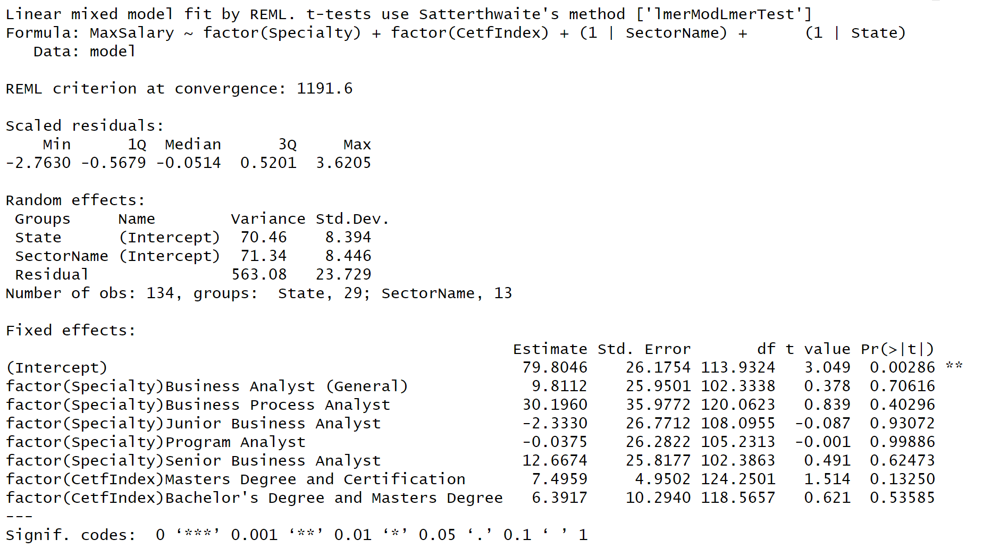

```{r setup, include=FALSE}
knitr::opts_chunk$set(echo = FALSE, warning = FALSE, message = FALSE)
library(DT)
library(magrittr)
library(dplyr)
library(ggplot2)
library(leaflet)
```

```{r}
load("job_skill.rData")
load("job_cet.rData")
job_skill <- job_skill %>% group_by(State,Skill) %>% summarise(n=n()) %>% arrange(State,-n)
job_skill %<>% filter(is.na(Skill) == FALSE)
job_certi <- job_cet %>% group_by(State,Certification) %>% summarise(n=n()) %>% arrange(State,-n)
job_certi %<>% filter(is.na(Certification) == FALSE)
```

## Introduction


## Data cleaning

- combine data sets into one
- remove columns
- select rows
- drop NA, replace -999 with NA
- generate new column

## EDA

```{r}
load("job.rData")
cPal <- colorNumeric(palette = "Oranges",domain=job$MinSalary)
job_map <- job %>% filter(Lat!=-999&MinSalary>0&MaxSalary>0) 
pop_gb <- paste("<strong>Job title</strong>: ",job_map$CleanTitle,"<br/>",
                   "<strong>Salary</strong> :",job_map$MinSalary,"~",job_map$MaxSalary,"<br/>",
                    "<strong>Employer</strong>: ",job_map$Employer)
leaflet(job_map) %>% addTiles() %>%
        addCircleMarkers(data=job_map,lng=~Lon,
                         lat=~Lat,
                         clusterOptions = markerClusterOptions(),
                         popup = pop_gb,
                         fillColor = ~cPal(job_map$MinSalary),
                         stroke = FALSE,fillOpacity = 0.9)%>%
        addLegend("bottomright", pal = cPal, values = ~MinSalary,title = "salary ",opacity = 1)
```

## Part A: popular skill and certifications

- group by and summarise data
- plot the counts of skills and certifications on each state
- compare other states with Massachusetts

## Interactive Plot {.smaller}

```{r eruptions}
fluidRow(style = "font-size: 12px;",
        column(4, selectInput("states", label = "Select a state:",
              choices = unique(job_skill$State), selected = "Arkansas")))

tabsetPanel(tabPanel(HTML("<span style='font-size:12px'>Top Skills</span>")
                     , column(5, dataTableOutput("skilltable"))
                     , column(7, plotOutput("skillplot"))
                     ),
            tabPanel(HTML("<span style='font-size:12px'>Top Certificates</span>")
                     , column(5, dataTableOutput("certitable"))
                     , column(7, plotOutput("certiplot"))
                     )
            ) #end of tabsetPanel

output$skilltable <- renderDataTable({job_skill[job_skill$State == input$states & is.na(job_skill$State) == FALSE, -1]}
                                     , filter = 'none'
                                     , extensions = "FixedColumns"
                                     , options = list(scrollX = TRUE
                                                      , scrollY = '300px'
                                                      , paging = FALSE)
)

output$skillplot <- renderPlot({
  ggplot(data = job_skill[job_skill$State == input$states & is.na(job_skill$State) == FALSE, ][1:min(10, nrow(job_skill[job_skill$State == input$states & is.na(job_skill$State) == FALSE, ])),], mapping=aes(n,reorder(Skill,n), fill=-n)) +
  geom_col()+
  xlab("count")+
  ylab("skill")+
  theme(legend.position = 'none')
})

output$certitable <- renderDataTable({job_certi[job_certi$State == input$states & is.na(job_certi$State) == FALSE, -1]}
                                     , filter = 'none'
                                     , extensions = "FixedColumns"
                                     , options = list(scrollX = TRUE
                                                      , scrollY = '300px'
                                                      , paging = FALSE)
)

output$certiplot <- renderPlot({
  ggplot(data = job_certi[job_certi$State == input$states & is.na(job_certi$State) == FALSE, ][1:min(10, nrow(job_certi[job_certi$State == input$states & is.na(job_certi$State) == FALSE, ])),], mapping=aes(n,reorder(Certification,n), fill=-n)) +
  geom_col()+
  xlab("count")+
  ylab("Certificates")+
  theme(legend.position = 'none')
})
```


## Interactive Plot {.smaller}

```{r}
states51 <- unique(job_skill$State)
states_noMA <- states51[states51 != "Massachusetts"]

fluidRow(style = "font-size: 12px;",
        column(4, selectInput("states2", label = "Select a state:",
              choices = c("All", states_noMA), selected = "All")))

tabsetPanel(tabPanel(HTML("<span style='font-size:12px'>Top Skills</span>")
                     , column(6, plotOutput("maskillplot"))
                     , column(6, plotOutput("nomaskillplot"))
                     ),
            tabPanel(HTML("<span style='font-size:12px'>Top Certifications</span>")
                     , column(6, plotOutput("macertiplot"))
                     , column(6, plotOutput("nomacertiplot"))
                     )
            ) #end of tabsetPanel

output$maskillplot <- renderPlot({
  ggplot(data = job_skill[job_skill$State == "Massachusetts" & is.na(job_skill$State) == FALSE, ][1:min(10, nrow(job_skill[job_skill$State == "Massachusetts" & is.na(job_skill$State) == FALSE, ])),], mapping=aes(n,reorder(Skill,n), fill=-n)) +
  geom_col()+
  xlab("count")+
  ylab("skill")+
  theme(legend.position = 'none') + 
    labs(title = "The Top Skills of MA")
})

output$nomaskillplot <- renderPlot(
  if (input$states2 == "All") {
    df <- job_skill[job_skill$State != "Massachusetts" & is.na(job_skill$State) == FALSE, ] %>% group_by(Skill) %>% summarise(sum = sum(n)) %>% arrange(-sum)
    ggplot(data = df[1:ifelse(nrow(df)<10, nrow(df), 10),], mapping=aes(sum,reorder(Skill,sum), fill=-sum)) +
  geom_col()+
  xlab("count")+
  ylab("skill")+
  theme(legend.position = 'none')
  }
  else {
  ggplot(data = job_skill[job_skill$State == input$states2 & is.na(job_skill$State) == FALSE, ][1:min(10, nrow(job_skill[job_skill$State == input$states2 & is.na(job_skill$State) == FALSE, ])),], mapping=aes(n,reorder(Skill,n), fill=-n)) +
  geom_col()+
  xlab("count")+
  ylab("skill")+
  theme(legend.position = 'none')
})

output$macertiplot <- renderPlot({
  ggplot(data = job_certi[job_certi$State == "Massachusetts" & is.na(job_certi$State) == FALSE,], mapping=aes(n,reorder(Certification,n), fill=-n)) +
  geom_col()+
  xlab("count")+
  ylab("Certificate")+
  theme(legend.position = 'none') + 
    labs(title = "The Top Certificates of MA")
})

output$nomacertiplot <- renderPlot(
  if (input$states2 == "All") {
    df <- job_certi[job_certi$State != "Massachusetts" & is.na(job_certi$State) == FALSE, ] %>% group_by(Certification) %>% summarise(sum = sum(n)) %>% arrange(-sum)
    ggplot(data = df[1:ifelse(nrow(df)<10, nrow(df), 10),], mapping=aes(sum,reorder(Certification,sum), fill=-sum)) +
  geom_col()+
  xlab("count")+
  ylab("Certificate")+
  theme(legend.position = 'none')
  }
  else {
  ggplot(data = job_certi[job_certi$State == input$states2 & is.na(job_certi$State) == FALSE, ][1:min(10, nrow(job_certi[job_certi$State == input$states2 & is.na(job_certi$State) == FALSE, ])),], mapping=aes(n,reorder(Certification,n), fill=-n)) +
  geom_col()+
  xlab("count")+
  ylab("Certificate")+
  theme(legend.position = 'none')
})
```

----

### Conclusion

- MA-skills: Business Analysis, Communication,  skills, Business Process, Teamwork/collaboration, Excel

- MA-certification: Chartered Alternative Investment Analyst (CAIA), Series 3, Leadership In Energy And Environmental Design (LEED) Certified, IT Infrastructure Library (ITIL) Certification, Mbe Certified

- Top 5 of skills almost the same. SQL and training materials listed in top 10 skills of MA are not included in other states at total.

- For certification, there is too many missing data in MA. For other states, Project Management Certification and Security Clearance are always mentioned.

## Part B: certifications and salary offerings {.smaller}

- drop sector name = NA

|Degree   |MaxDegree   |Certification| CertifIndex |
|:-----:  |:-----:    |:-----:      | :-----:     |
|Bachelor's  |NA    |NA      |A|
|Master's    |NA    |NA      |B|
|NA          |NA    |Any certification      |C|
|Bachelor's  |Master's    |NA      |AB|
|Bachelor's  |NA    |Any certification      |AC|
|NA  |Master's    |Any certification      |BC|

-----

- remove rows that CertifIndex = NA

- compute average salary and count the jobs

    - group by `sectorname` and `CertiIndex`
    
    - compute average min salary and average max salary
    

## Certifications and salary offerings{.smaller}

```{r q4}

job$CetfIndex <- factor(job$CetfIndex, levels = c("A","B","C","AB","AC","BC"), labels = c("Bachelor's Degree Only", "Master's Degree Only", "Certification Only", "Bachelor's Degree and Certification", "Masters Degree and Certification","Bachelor's Degree and Masters Degree"))

job[job==-999] <- NA
job <- filter(job, !is.na(job$SectorName))

fluidRow(style = "font-size: 12px;",
        column(4, selectInput("SectorName", label = "Select an Industry:",
              choices = c("All", unique(job$SectorName)), selected = "All")))

tabsetPanel(tabPanel(HTML("<span style='font-size:12px'>Certifications and Salary</span>")
                     , column(12, dataTableOutput("Salary"))
                     ),
            tabPanel(HTML("<span style='font-size:12px'>Certifications and Position Number</span>")
                     , column(12, dataTableOutput("Count"))
                     )
            )

output$Salary <- renderDataTable({job %>% filter(CetfIndex %in% c("Bachelor's Degree Only", "Master's Degree Only", "Certification Only")) %>%
    group_by(SectorName, CetfIndex) %>% 
    summarize(AverageMinSalary = round(mean(MinSalary, na.rm=TRUE),0), 
              AverageMaxSalary = round(mean(MaxSalary, na.rm=TRUE),0)) %>% 
    filter(ifelse(input$SectorName == "All", 
                  SectorName != "" ,
                  SectorName == input$SectorName)) %>%
    arrange(SectorName, -AverageMinSalary)}
                                     , filter = 'none'
                                     , extensions = "FixedColumns"
                                     , options = list(scrollX = TRUE
                                                      , scrollY = '300px'
                                                      , paging = FALSE)
)

output$Count <- renderDataTable({job %>% filter(CetfIndex %in% c("Bachelor's Degree Only", "Master's Degree Only", "Certification Only")) %>%
    group_by(SectorName, CetfIndex) %>% 
    filter(ifelse(input$SectorName == "All", 
                  SectorName != "" ,
                  SectorName == input$SectorName)) %>%
    summarize(JobCount = n()) %>% 
    arrange(SectorName, -JobCount)}
                                     , filter = 'none'
                                     , extensions = "FixedColumns"
                                     , options = list(scrollX = TRUE
                                                      , scrollY = '300px'
                                                      , paging = FALSE)
)
```

## Higher salary offerings{.smaller}

```{r q51}
tabsetPanel(tabPanel(HTML("<span style='font-size:12px'>All Industry</span>")
                     , column(12, dataTableOutput("Industry"))
                     )
            )

output$Industry <- renderDataTable({job %>% filter(CetfIndex %in% c("Bachelor's Degree and Certification", "Masters Degree and Certification","Bachelor's Degree and Masters Degree")) %>%
    group_by(CetfIndex) %>% 
    summarize(JobCount = n(), 
              AverageMinSalary = round(mean(MinSalary, na.rm=TRUE),0), 
              AverageMaxSalary = round(mean(MaxSalary, na.rm=TRUE),0)) %>% 
    arrange(-JobCount)}
                                     , filter = 'none'
                                     , extensions = "FixedColumns"
                                     , options = list(scrollX = TRUE
                                                      , scrollY = '300px'
                                                      , paging = FALSE)
)
```

## Higher salary in different Industies{.smaller}

```{r q52}
fluidRow(style = "font-size: 12px;",
        column(4, selectInput("SectorName2", label = "Select an Industry:",
              choices = c("All", unique(job$SectorName)), selected = "All")))

tabsetPanel(tabPanel(HTML("<span style='font-size:12px'>Certifications and Salary</span>")
                     , column(12, dataTableOutput("Salary5"))
                     ),
            tabPanel(HTML("<span style='font-size:12px'>Certifications and Position Number</span>")
                     , column(12, dataTableOutput("Count5"))
                     )
            )

output$Salary5 <- renderDataTable({job %>% filter(CetfIndex %in% c("Bachelor's Degree and Certification", "Masters Degree and Certification","Bachelor's Degree and Masters Degree")) %>%
    group_by(SectorName, CetfIndex) %>% 
    summarize(AverageMinSalary = round(mean(MinSalary, na.rm=TRUE),0), 
              AverageMaxSalary = round(mean(MaxSalary, na.rm=TRUE),0)) %>% 
    filter(ifelse(input$SectorName2 == "All", 
                  SectorName != "" ,
                  SectorName == input$SectorName2)) %>%
    arrange(SectorName, -AverageMinSalary)}
                                     , filter = 'none'
                                     , extensions = "FixedColumns"
                                     , options = list(scrollX = TRUE
                                                      , scrollY = '300px'
                                                      , paging = FALSE)
)

output$Count5 <- renderDataTable({job %>% filter(CetfIndex %in% c("Bachelor's Degree and Certification", "Masters Degree and Certification","Bachelor's Degree and Masters Degree")) %>%
    group_by(SectorName, CetfIndex) %>% 
    filter(ifelse(input$SectorName2 == "All", 
                  SectorName != "" ,
                  SectorName == input$SectorName2)) %>%
    summarize(JobCount = n()) %>% 
    arrange(SectorName, -JobCount)}
                                     , filter = 'none'
                                     , extensions = "FixedColumns"
                                     , options = list(scrollX = TRUE
                                                      , scrollY = '300px'
                                                      , paging = FALSE)
)
```


----

### Conclusion

- job count over 100: Professional, Scientific and Technical Services(over 1000), Finance and Insurance,  Public Administration, Manufacturing, Information, Health Care and Social Assistance

- we found certification is very important, someone having a master's degree but no certification has lower salary than who has certifications with only bachelor's degree.


## Linear Mixed Effect Model{.smaller}

```{r eval=FALSE, message=FALSE, warning=FALSE, include=FALSE}
model <- job %>% filter(CetfIndex %in% c("Bachelor's Degree and Certification", "Masters Degree and Certification","Bachelor's Degree and Masters Degree"))
library("lme4")
library("lmerTest")
model$MinSalary <- model$MinSalary/1000
model$MaxSalary <- model$MaxSalary/1000
fit.1 <- lmer(MinSalary ~  factor(Specialty) + factor(CetfIndex) + (1|SectorName) + (1|State), data = model)
summary(fit.1)

fit.2 <- lmer(MaxSalary ~ factor(Specialty) + factor(CetfIndex) + (1|SectorName) + (1|State), data = model) 
summary(fit.2)


job$MinSalary <- job$MinSalary/1000
job$MaxSalary <- job$MaxSalary/1000
fit.3 <- lmer(MinSalary ~ factor(Specialty) + factor(CetfIndex) + (1|SectorName) + (1|State), data = job)
summary(fit.3)

fit.4 <- lmer(MaxSalary ~ factor(Specialty) + factor(certsIdx) + factor(Degree) + (1|SectorName) + (1|State), data = job)
summary(fit.4)
```

### MinSalary Affected By Specialty and Qualify
```{r out.width = '100%'}

```

----

### MaxSalary Affected By Specialty and Qualify
```{r out.width = '100%'}

```


