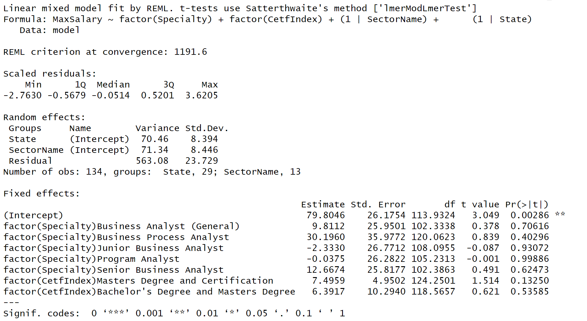

```{r setup, include=FALSE}
knitr::opts_chunk$set(echo = FALSE, warning = FALSE, message = FALSE)
library(DT)
library(magrittr)
library(dplyr)
library(ggplot2)
```

## Certifications and salary offerings{.smaller}

```{r q4}
load("job.rData")

job$CetfIndex <- factor(job$CetfIndex, levels = c("A","B","C","AB","AC","BC"), labels = c("Bachelor's Degree Only", "Master's Degree Only", "Certification Only", "Bachelor's Degree and Certification", "Masters Degree and Certification","Bachelor's Degree and Masters Degree"))

job[job==-999] <- NA
job <- filter(job, !is.na(job$SectorName))

fluidRow(style = "font-size: 12px;",
        column(4, selectInput("SectorName", label = "Select an Industry:",
              choices = c("All", unique(job$SectorName)), selected = "All")))

tabsetPanel(tabPanel(HTML("<span style='font-size:12px'>Certifications and Salary</span>")
                     , column(12, dataTableOutput("Salary"))
                     ),
            tabPanel(HTML("<span style='font-size:12px'>Certifications and Position Number</span>")
                     , column(12, dataTableOutput("Count"))
                     )
            )

output$Salary <- renderDataTable({job %>% filter(CetfIndex %in% c("Bachelor's Degree Only", "Master's Degree Only", "Certification Only")) %>%
    group_by(SectorName, CetfIndex) %>% 
    summarize(AverageMinSalary = round(mean(MinSalary, na.rm=TRUE),0), 
              AverageMaxSalary = round(mean(MaxSalary, na.rm=TRUE),0)) %>% 
    filter(ifelse(input$SectorName == "All", 
                  SectorName != "" ,
                  SectorName == input$SectorName)) %>%
    arrange(SectorName, -AverageMinSalary)}
                                     , filter = 'none'
                                     , extensions = "FixedColumns"
                                     , options = list(scrollX = TRUE
                                                      , scrollY = '300px'
                                                      , paging = FALSE)
)

output$Count <- renderDataTable({job %>% filter(CetfIndex %in% c("Bachelor's Degree Only", "Master's Degree Only", "Certification Only")) %>%
    group_by(SectorName, CetfIndex) %>% 
    filter(ifelse(input$SectorName == "All", 
                  SectorName != "" ,
                  SectorName == input$SectorName)) %>%
    summarize(JobCount = n()) %>% 
    arrange(SectorName, -JobCount)}
                                     , filter = 'none'
                                     , extensions = "FixedColumns"
                                     , options = list(scrollX = TRUE
                                                      , scrollY = '300px'
                                                      , paging = FALSE)
)
```

## Higher salary offerings{.smaller}

```{r q51}
tabsetPanel(tabPanel(HTML("<span style='font-size:12px'>All Industry</span>")
                     , column(12, dataTableOutput("Industry"))
                     )
            )

output$Industry <- renderDataTable({job %>% filter(CetfIndex %in% c("Bachelor's Degree and Certification", "Masters Degree and Certification","Bachelor's Degree and Masters Degree")) %>%
    group_by(CetfIndex) %>% 
    summarize(JobCount = n(), 
              AverageMinSalary = round(mean(MinSalary, na.rm=TRUE),0), 
              AverageMaxSalary = round(mean(MaxSalary, na.rm=TRUE),0)) %>% 
    arrange(-JobCount)}
                                     , filter = 'none'
                                     , extensions = "FixedColumns"
                                     , options = list(scrollX = TRUE
                                                      , scrollY = '300px'
                                                      , paging = FALSE)
)
```

## Higher salary in different Industies{.smaller}

```{r q52}
fluidRow(style = "font-size: 12px;",
        column(4, selectInput("SectorName2", label = "Select an Industry:",
              choices = c("All", unique(job$SectorName)), selected = "All")))

tabsetPanel(tabPanel(HTML("<span style='font-size:12px'>Certifications and Salary</span>")
                     , column(12, dataTableOutput("Salary5"))
                     ),
            tabPanel(HTML("<span style='font-size:12px'>Certifications and Position Number</span>")
                     , column(12, dataTableOutput("Count5"))
                     )
            )

output$Salary5 <- renderDataTable({job %>% filter(CetfIndex %in% c("Bachelor's Degree and Certification", "Masters Degree and Certification","Bachelor's Degree and Masters Degree")) %>%
    group_by(SectorName, CetfIndex) %>% 
    summarize(AverageMinSalary = round(mean(MinSalary, na.rm=TRUE),0), 
              AverageMaxSalary = round(mean(MaxSalary, na.rm=TRUE),0)) %>% 
    filter(ifelse(input$SectorName2 == "All", 
                  SectorName != "" ,
                  SectorName == input$SectorName2)) %>%
    arrange(SectorName, -AverageMinSalary)}
                                     , filter = 'none'
                                     , extensions = "FixedColumns"
                                     , options = list(scrollX = TRUE
                                                      , scrollY = '300px'
                                                      , paging = FALSE)
)

output$Count5 <- renderDataTable({job %>% filter(CetfIndex %in% c("Bachelor's Degree and Certification", "Masters Degree and Certification","Bachelor's Degree and Masters Degree")) %>%
    group_by(SectorName, CetfIndex) %>% 
    filter(ifelse(input$SectorName2 == "All", 
                  SectorName != "" ,
                  SectorName == input$SectorName2)) %>%
    summarize(JobCount = n()) %>% 
    arrange(SectorName, -JobCount)}
                                     , filter = 'none'
                                     , extensions = "FixedColumns"
                                     , options = list(scrollX = TRUE
                                                      , scrollY = '300px'
                                                      , paging = FALSE)
)
```

## Linear Mixed Effect Model{.smaller}

```{r eval=FALSE, message=FALSE, warning=FALSE, include=FALSE}
model <- job %>% filter(CetfIndex %in% c("Bachelor's Degree and Certification", "Masters Degree and Certification","Bachelor's Degree and Masters Degree"))
library("lme4")
library("lmerTest")
model$MinSalary <- model$MinSalary/1000
model$MaxSalary <- model$MaxSalary/1000
fit.1 <- lmer(MinSalary ~  factor(Specialty) + factor(CetfIndex) + (1|SectorName) + (1|State), data = model)
summary(fit.1)

fit.2 <- lmer(MaxSalary ~ factor(Specialty) + factor(CetfIndex) + (1|SectorName) + (1|State), data = model) 
summary(fit.2)


job$MinSalary <- job$MinSalary/1000
job$MaxSalary <- job$MaxSalary/1000
fit.3 <- lmer(MinSalary ~ factor(Specialty) + factor(CetfIndex) + (1|SectorName) + (1|State), data = job)
summary(fit.3)

fit.4 <- lmer(MaxSalary ~ factor(Specialty) + factor(certsIdx) + factor(Degree) + (1|SectorName) + (1|State), data = job)
summary(fit.4)
```

### MinSalary Affected By Specialty and Qualify
```{r out.width = '100%'}
knitr::include_graphics("MinSalary.png")
```

----

### MaxSalary Affected By Specialty and Qualify
```{r out.width = '100%'}

```
